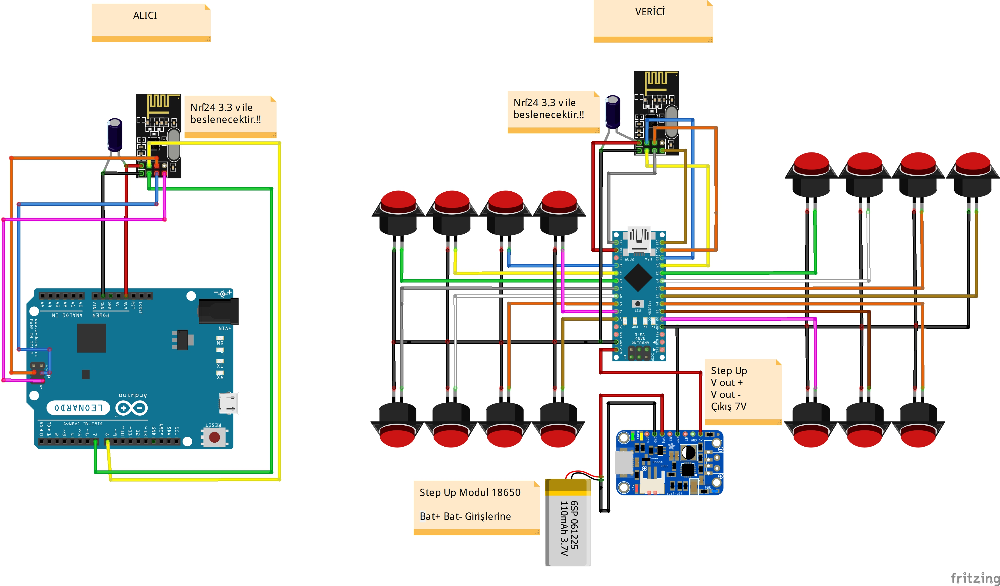

# Malzeme Listesi

- NRF24 x 2
- Arduino Leonardo
- Arduino Nano
- 100uf 16v kondansatör
- 3.7v 18650 Pil
- 18650 step up booster
- Push button

# Kurulum ve Detaylar

`:TODO:`

# Kablolama

**DIY SIM EQUIPMENT**

_Discord_
https://discord.gg/b6NUUM6aRH
